In today's data analysis landscape, the optimization of complex graph queries has been a persistent challenge for the industry. GOpt is an optimizer framework designed for complex graph queries and was officially presented at [SIGMOD Industry 2025](https://arxiv.org/abs/2401.17786). Its core objective is to provide an efficient and universal optimization solution that adapts to various graph query languages and execution engines. In this article, we will delve into the key innovations of GOpt in unified graph query optimization and analyze its optimization process through specific query cases from [LDBC SNB](https://ldbcouncil.org/benchmarks/snb).

GOpt achieves breakthroughs in the following areas:

- Seamless support for mainstream graph query languages: GOpt is compatible with current leading graph query languages, including [Cypher](https://neo4j.com/docs/cypher-manual/current/introduction) and [Gremlin](https://tinkerpop.apache.org), with future plans to further support the graph query standard [GQL](https://www.gqlstandards.org).

- Unified optimization of complex patterns: Deep optimization of various complex patterns such as Triangle, Path, Square, Clique, etc. Figure Fig.1 illustrates the various complex pattern forms supported by GOpt.

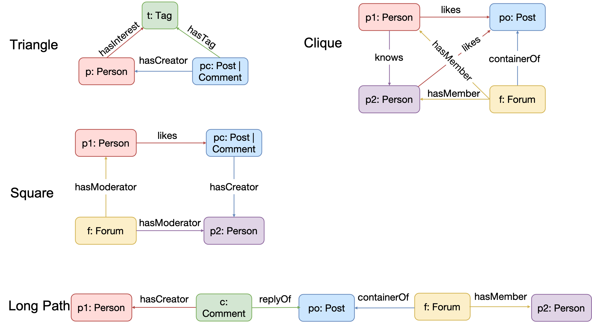
<div style="text-align: center;">Fig.1 Complex Patterns Supported by GOpt.</div>

- Support for multi-pattern features in Cypher queries: GOpt first represents multi-patterns according to Cypher semantics as Inner/Left/Anti Joins, converting optimizations between multiple patterns into optimizations for Joins, thus directly reusing mature Join optimization rules from relational databases. Fig.2 showcases the various multi-pattern queries supported by GOpt and their internal representations within GOpt.

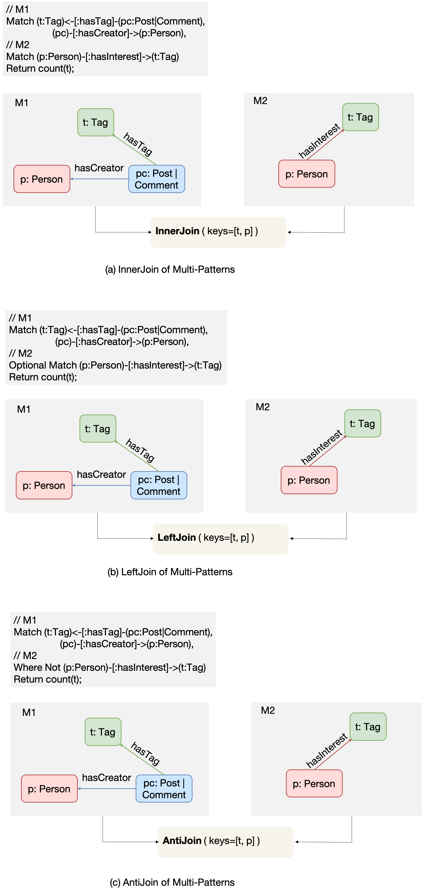
<div style="text-align: center;">Fig.2 Multi-Patterns Supported by GOpt.</div>

- Integration with popular graph query execution engines: In a previous article [Revolution: Enhancing Neo4j Efficiency with GOpt](https://mp.weixin.qq.com/s/07w8YaH0VmhgJXJkDN0KUg), we integrated GOpt into the Neo4j engine. Figure Fig.3 compares the execution effects of Neo4j and the GOpt optimization plans on the Neo4j engine. Within the [LDBC Social Network Benchmark (LDBC SNB)](https://ldbcouncil.org/benchmarks/snb) standard test suite (where IC and BI represent Interactive-Complex and Business Intelligence queries respectively), GOpt brings an average improvement of 15.8X for Neo4j. We have further integrated GOpt into the GraphScope engine, achieving an average query performance improvement of 243.4X compared to GraphScope’s built-in rule-based optimizer.

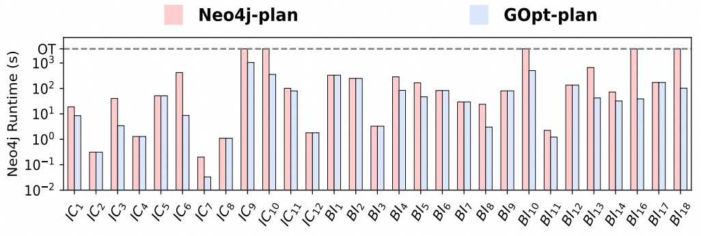
<div style="text-align: center;">Fig.3 Time Cost of LDBC Queries on Neo4j.</div>

In this article, we will further explore points 1, 2, and 3, delving deeply into the optimization process of GOpt. We have chosen standard queries from LDBC SNB as a case study to intuitively demonstrate GOpt's optimization process. Regarding point 4, GOpt has designed a dedicated Physical Converter layer. However, due to the excessive focus on underlying implementations, we will release subsequent articles on our official account to further decrypt this part, mainly covering: "How to Integrate GOpt with Neo4j?" and "How to Integrate GOpt with DuckDB?". Stay tuned.

## Optimization Process

Fig.4 illustrates the system framework of GOpt, which mainly consists of the following three layers:

1. **Query Parser**: Cypher/Gremlin queries first undergo syntax checking via [Antlr](https://www.antlr.org), followed by conversion of the Antlr AST into an initial GIR structure through the GIRBuilder Tool.

2. **GIR Optimizer**: Applies optimizations based on the GIR structure, performing transform operations on the input GIR structure and outputting an optimized GIR structure. Depending on the implementation of transforms, optimizations can be executed based on heuristic or top-down search approaches.

3. **Physical Convertor**: Further converts the physical execution plan into code that can be executed by backend engines.

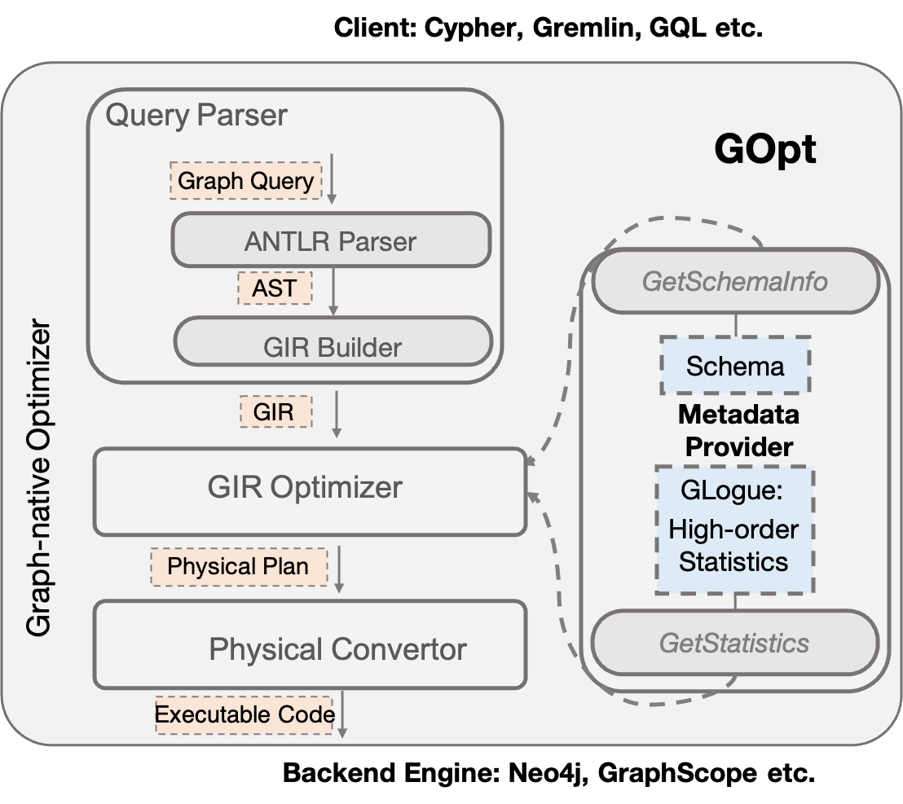
<div style="text-align: center;">Fig.4 System Overview of GOpt.</div>

### GIR Structure

Firstly, let's introduce what the GIR structure is. GIR (Graph Intermediate Representation) is a graph query language-independent intermediate data structure for graph queries, encompassing definitions of data models and a series of operator combinations for manipulating these data models.

The data model in GIR consists of graph data types and basic data types. Graph data types include Vertex (nodes), Edge (relationships), Path (paths), etc. Basic data types refer to Integer (integer), Float (floating point), String (character), Array/Map/Set (composite types), etc. GIR adopts data formats from relational databases: each data tuple contains multiple items, each with a name and a value, where the value type can be either a graph data type or a basic data type.

Operator combinations in GIR include graph operators and relational operators.

Graph operators define how queries retrieve graph data, including:

1. GET_VERTEX: Represents fetching node data sources from a graph database or retrieving endpoints from input edge data.
2. EXPAND_EDGE: Represents fetching edge data sources from a graph database or expanding adjacent edges from input node data.
3. EXPAND_PATH: Represents expanding paths composed of multiple edges from input node data.
4. MATCH_PATTERN: Expresses the Match Clause in Cypher or Gremlin as a unified structure. In GIR, there are two ways to represent this: a. A composite structure consisting of the aforementioned graph operators, marked by `MATCH_START` and `MATCH_END` indicating the start and end of graph operators. b. Represented as a Graph structure using [JGraphT](https://jgrapht.org). These two structures are equivalent and can be converted interchangeably, as shown in Fig.5(c), where the Match Clause in the left-side query is represented uniformly in both forms.

Relational operators include Filter, Sort, Limit, Unfold, Project, Group, Join, Union. The support for them in GOpt is consistent with traditional databases, hence we will not elaborate further here. As illustrated in Fig.5(c), both Cypher query Fig.5(a) and Gremlin query Fig.5(b) are uniformly represented as corresponding GIR structures.

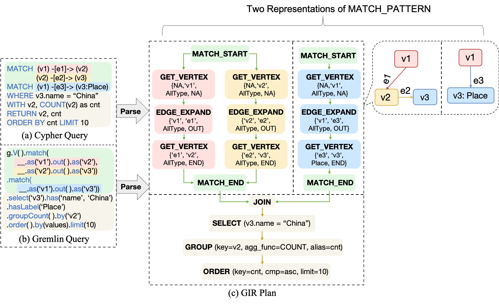
<div style="text-align: center;">Fig.5 GIR Representation of Query Example.</div>

## Optimization Strategies

Next, we introduce how GOpt optimizes queries based on the GIR structure. The entire optimization process in the GIR Optimizer can be represented as a Directed Acyclic Graph (DAG). Each node in the DAG represents a Strategy, which embodies the execution of one or more rules. The edges in the DAG represent the sequential order of rule execution. GOpt executes these rules according to the topological sort of the DAG graph. Figure 6 shows a series of Strategies implemented by GOpt and their corresponding DAG relationships.

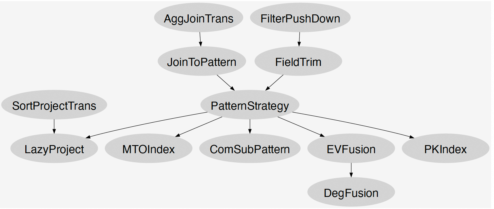
<div style="text-align: center;">Figure 6: DAG of Optimization Process in GOpt.</div>

The interface definition for Strategy is as follows:

```java
interface Strategy {
    GIRPlan transform(GIRPlan input);
}
```

Based on this interface, GOpt provides two types of Strategy implementations: RuleBasedStrategy and PatternStrategy.

RuleBasedStrategy includes a series of heuristic rules, where each rule specifically implements the transform function to perform equivalent transformations on the input GIRPlan and output the transformed GIRPlan. These rules are partly reused from Calcite, including: FieldTrim, SortProjectTrans, AggJoinTrans. Additionally, to handle specific optimizations related to graph data and operations, GOpt has implemented specialized rules for graph data models, including: FilterIntoPattern, JoinToPattern, ComSubPattern, EVFusion, DegFusion, PKIndex, and LateProject.

PatternStrategy primarily optimizes the sequence of graph operators within Patterns, referred to as PatternOrders. The transform method takes a Logical GIRPlan, composed of `MATCH_PATTERN` and other relational operators, as shown in Figure 7(a); it outputs a Physical GIRPlan representing the PatternOrder, consisting of a series of physical operators, as shown in Figure 7(b). The transform method executes a top-down search algorithm as described in the [GOpt paper](https://arxiv.org/abs/2401.17786), obtaining a series of PatternOrders along with their respective costs, and selects the PatternOrder with the lowest cost as the output Physical GIRPlan.

Finally, through the Physical Convertor, the Physical GIRPlan is converted into an Execution Plan supported by various engines. As shown in Figure 7(c), the Physical GIRPlan is converted into an Execution Plan supported by the GraphScope engine, where `Expand(v1->v2, v3->v2)` is converted to the ExpandIntersect implementation. In the Neo4j engine, this operator is converted to the ExpandInto implementation, as shown in Figure 7(d).

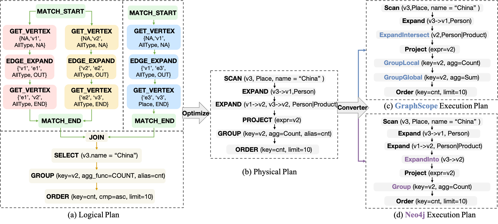
<div style="text-align: center;">Figure 7: Optimization and Physical Conversion of Query Example.</div>

# Case Study

We selected a query case from LDBC SNB that involves complex patterns, multiple patterns, and aggregate computations, which are common optimization requirements. We represent this query using Fig.8 and Cypher as follows:

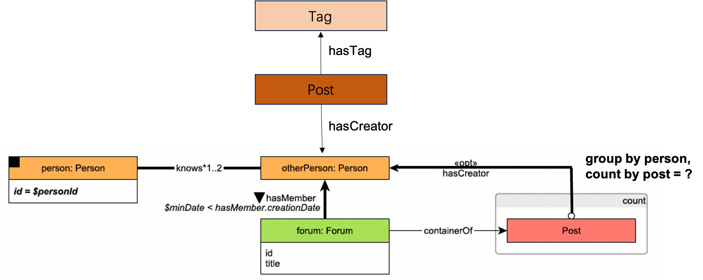
<div style="text-align: center;">Fig.8 Query Case Description.</div>

```cypher
// M1
MATCH (person:PERSON)-[:KNOWS*1..3]-(otherP),
      (otherP)<-[membership:HASMEMBER]-(forum)

// M2
MATCH (otherP)<-[:HASCREATOR]-(post)<-[:CONTAINEROF]-(forum)

// M3
MATCH (otherP)<-[:HASCREATOR]-(:POST)-[:HASTAG]->(tag:Tag)

// Filter
WHERE person.id = $personId
      AND otherP <> $personId
      AND membership.joinDate > $minDate

// Aggregate
RETURN otherP, count(post) AS post_cnt;
```

GOpt first converts the Cypher query into GIR (Graph Intermediate Representation) through the Query Parser, as shown in Fig.9. M1, M2, and M3 form the initial Join structure, followed by a series of relational operations.

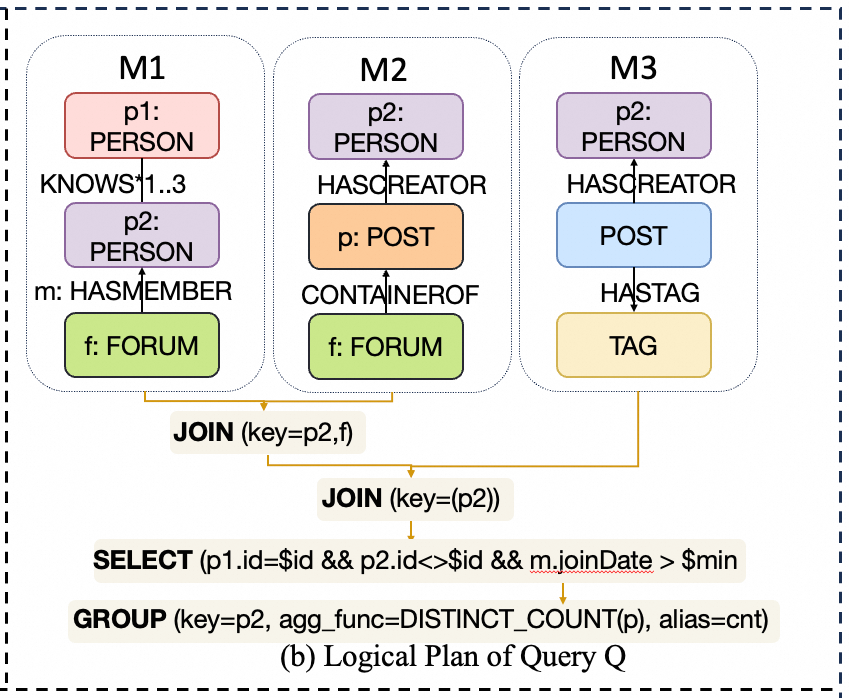
<div style="text-align: center;">Fig.9 Initial GIR of the Query Case.</div>

Next, the GIR Optimizer applies optimizations to the GIR based on strategies defined in the DAG (Directed Acyclic Graph). In the DAG diagram, we highlight the strategies that take effect for this query, as shown in Fig.10.

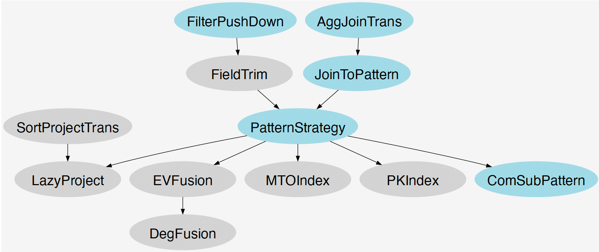
<div style="text-align: center;">Fig.10 DAG of Optimization Process in the Query Case.</div>

## Optimization Rules

We further explain the optimization rules applicable to this query:

- FilterIntoPattern: An extended implementation based on Calcite's FilterIntoJoin. It pushes filtering conditions further down to graph operation operators within patterns. For example, given the following Cypher query:

    ```cypher
    MATCH (v1)-[e1]->(v2),
        (v2)-[e2]->(v3),
        (v1)-[e3]->(v3)
    // There is a <Join> between the two patterns in GIR
    MATCH (v1)-[e4]->(v4)
    WHERE v3.name = "China"
    RETURN v1.name, count(v2);
    ```
    After applying this rule, the optimized query is equivalent to rewriting it as:

    ```cypher
    MATCH (v1)-[e1]->(v2),
        (v2)-[e2]->(v3 {name: 'China'}),
        (v1)-[e3]->(v3 {name: 'China'})
    // There is a <Join> between the two patterns in GIR
    MATCH (v1)-[e4]->(v4)
    RETURN v1.name, count(v2);
    ```

- AggJoinTrans: Pushes aggregate operations down to the Join operator. This optimization rule is inspired by [relational databases](https://calcite.apache.org/javadocAggregate/org/apache/calcite/rel/rules/AggregateJoinTransposeRule.html).

- JoinToPattern: Removes the Join operator between patterns and merges the left and right sub-patterns into a unified pattern. Whether patterns can be merged depends on whether the semantics remain consistent after merging. Based on the semantic requirements of different query languages, we define three types of semantics within patterns:
   - Homomorphism Semantics: Allows repetition of vertices or edges within the pattern, which is adopted by Gremlin.
   - Edge-Distinct Semantics: Allows repetition of vertices but not edges within the pattern, which is adopted by Cypher.
   - Vertex-Distinct Semantics: Allows repetition of edges but not vertices.
   - Vertex-Edge-Distinct Semantics: Neither vertices nor edges can repeat within the pattern.

   Since the Join between two patterns inherently represents Homomorphism semantics, this rule only applies under that premise.
- PatternStrategy: As described earlier, this strategy applies a Top-Down Search Algorithm to the input pattern structure and selects the optimal PatternOrder based on cost.
- ComSubPattern: For the two sub-patterns involved in a Join, extracts their common parts as the original input data. If the common part consists of only a single vertex, the Join operation can be further optimized into an Expand operation.

## Optimization Process

The GIR Optimizer executes specific strategies on the GIR in the order specified by Fig.10:

- FilterIntoPattern is performed first: The filtering conditions `{person.id = $personId, otherP <> $personId, membership.joinDate > $minDate}` are pushed down to the graph operators that generate `person` nodes, `otherP` nodes, and `membership` edges.

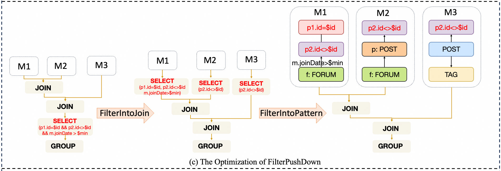
<div style="text-align: center;">Fig.11 The Optimization of FilterIntoPattern.</div>

- Next, AggJoinTrans is executed: This involves splitting the `{otherP, count(post) as post_cnt;}` related group operation. Part of it is pushed down into the left branch of the Join, while the other part remains after the Join to sum up the previously computed group results to ensure semantic equivalence.

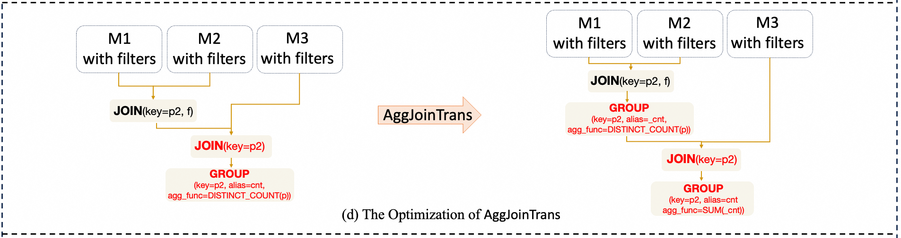
<div style="text-align: center;">Fig.12 The Optimization of AggJoinTrans.</div>

- JoinToPattern is then applied: The Join operation between M1 and M2 is removed, and M1 and M2 are merged into a unified pattern M4. In this example, we assume the patterns conform to Homomorphism semantics, which is a prerequisite for applying this rule.

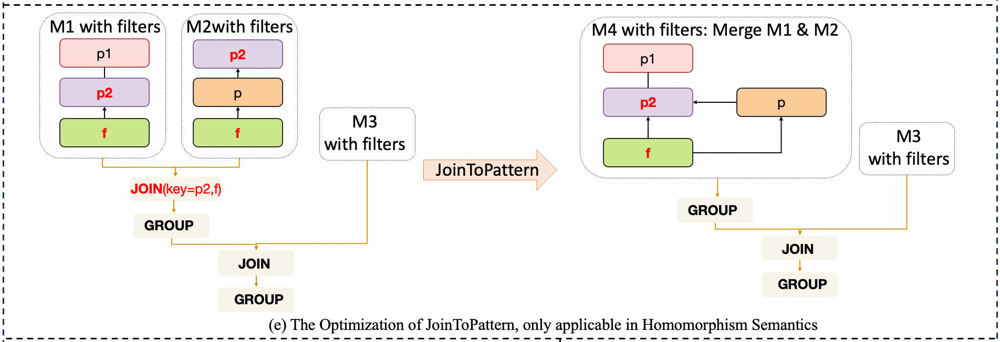
<div style="text-align: center;">Fig.13 The Optimization of JoinToPattern.</div>

- PatternStrategy is executed next: The following figure represents the output Optimal Pattern Order, consisting of a series of physical operators.

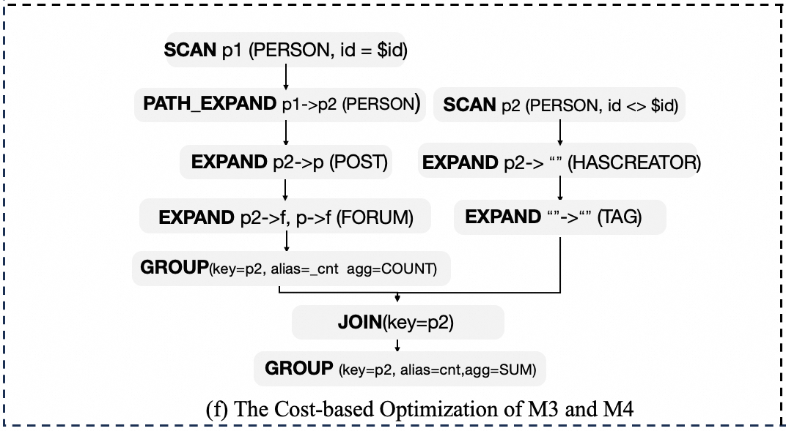
<div style="text-align: center;">Fig.14 The Optimization of PatternStrategies in M3 and M4.</div>

- Finally, ComSubPattern is applied: This optimizes the reusable common results between patterns. As shown in Fig.14, in the left branch of the Join, M4 produces two columns `(p2, _cnt)` after performing a Group operation, while the optimized PatternOrder of the right branch M3 starts with `Scan p2(PERSON, id <> $id)`. Given that the common part only contains the single point p2, according to the ComSubPattern rule, the Join structure is further optimized into an Expand operation. Hence, M3 directly continues from the P2 point produced by the Group operation to execute `Expand p2->"" (HASCREATOR)`.

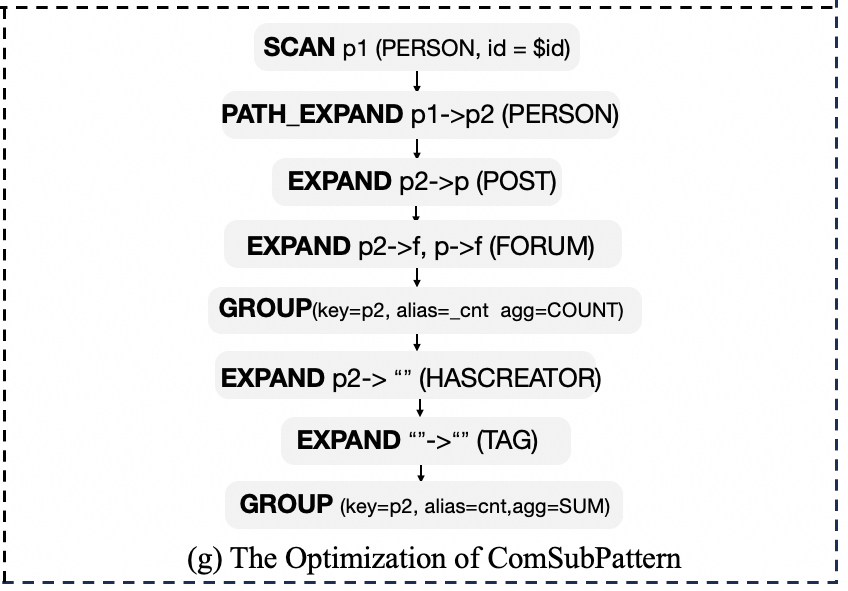
<div style="text-align: center;">Fig.15 The Optimization of ComSubPattern Between M3 and M4.</div>

## Experimental Results

For the aforementioned case study, we conducted two main experiments: ablation tests and Pattern Orders. We used the LDBC<sub>100</sub> dataset, as shown in Table Tab.1.

```html
<style>
  /* 修复版容器样式 */
  .table-container {
    display: flex;
    justify-content: center;
    width: 100%;
    overflow-x: auto;
    padding: 10px 0;
    background-color: transparent;
  }

  /* 修复版表格样式 */
  .table-container table {
    margin: 1rem 0;
    border-collapse: collapse;
    box-shadow: 0 0 10px rgba(0,0,0,0.1);
    white-space: nowrap;
  }

  /* 表格单元格样式 */
  .table-container td,
  .table-container th {
    padding: 8px 12px;
    border: 1px solid #e0e0e0;
  }
</style>

<div class="table-container">

| Graph | \|V\| | \|E\| | Size  |
| ----- | ----- | ----- | ----- |
| sf100 | 283M  | 1754M | 156GB |

</div>
```

<div style="text-align:center;">Tab.1 The LDCB<sub>100</sub> DataSet.</div>

The system configuration consists of a single node with the following specifications:
- 8-core Intel Xeon E5-2620 v4 CPUs at 2.1GHz
- 512GB memory
- 10Gbps network.

We used the [GraphScope v0.29.0](https://github.com/alibaba/GraphScope/releases/tag/v0.29.0) system, powered by the underlying [Gaia](https://github.com/alibaba/GraphScope/tree/main/interactive_engine/executor/engine/pegasus) engine, with 32 threads.

The ablation tests primarily compare the individual optimization effects of the rules: FilterIntoPattern, AggJoinTrans, JoinToPattern, and ComSubPattern. To avoid mutual interference between these rules, we sequentially added them in the order defined in Fig.10 and compared the execution time after each rule was added. The results are shown in Table Tab.2.

```html
<div class="table-container">

| Rules              | Time Cost (ms) |
| ------------------ | -------------- |
| None               | 770573         |
| +FilterIntoPattern | 234313         |
| +AggJoinTrans      | 214955         |
| +JoinToPattern     | 64466          |
| +ComSubPattern     | 7014           |

</div>
```

<div style="text-align:center;">Tab.2 Time Cost of Ablation Tests in the Query Case.</div>

The Pattern Orders experiment compares the optimal order generated by PatternStrategy with two other randomly chosen orders. Figure Fig.16 illustrates the execution sequence of the three Pattern Orders and annotates the actual intermediate data volume produced at each step. Finally, we compare the execution times of the three orders in Table Tab.3.

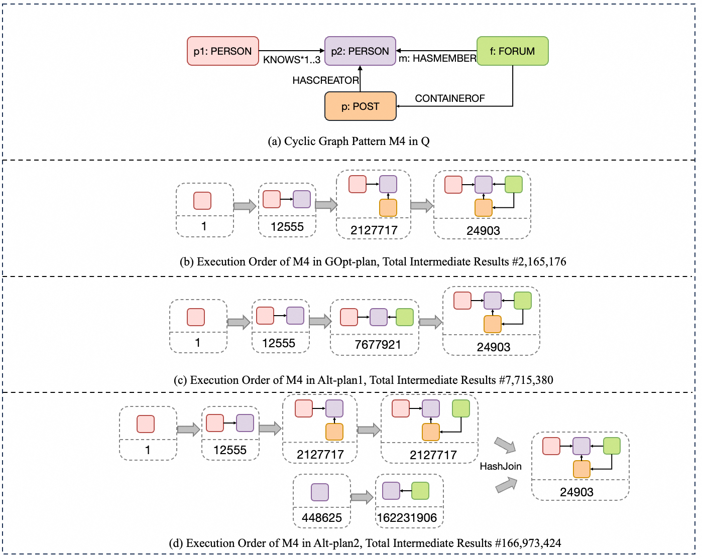
<div style="text-align: center;">Fig.16 Pattern Orders of GOpt-plan, Alt-plan1, Alt-plan2.</div>

```html
<div class="table-container">

| Rules     | Time Cost (ms) |
| --------- | -------------- |
| GOpt-plan | 7014           |
| Alt-plan1 | 22211          |
| Alt-plan2 | 194047         |

</div>
```

<div style="text-align:center;">Tab.3 Time Cost of Pattern Orders in the Query Case.</div>
