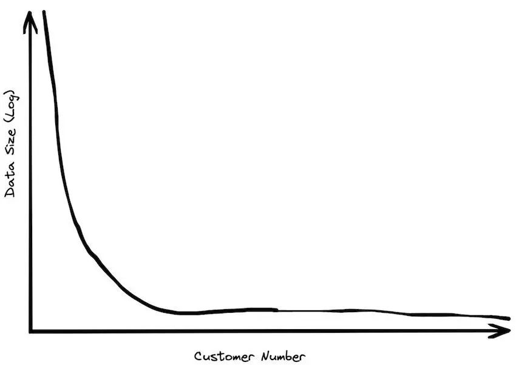
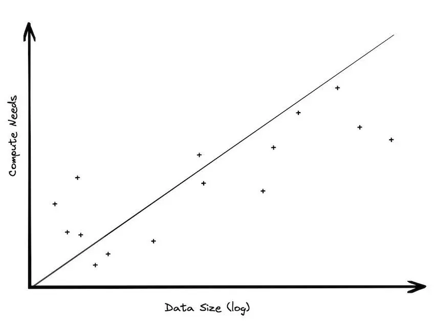
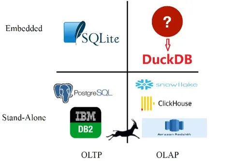
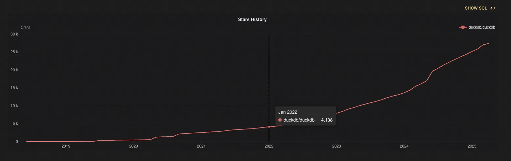
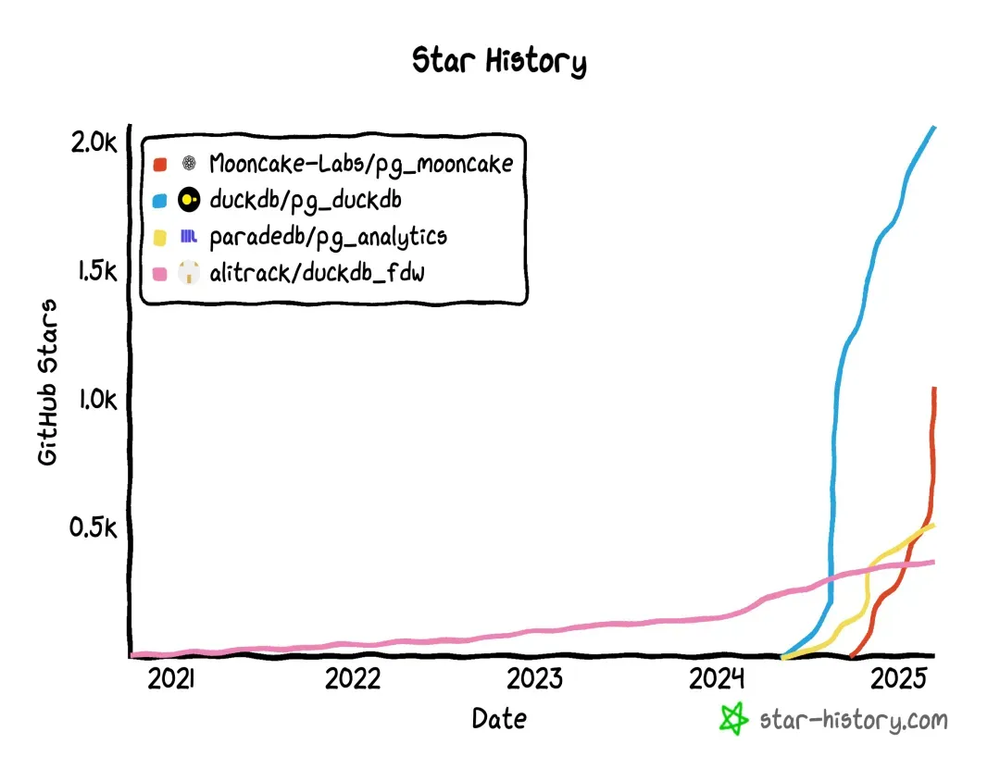
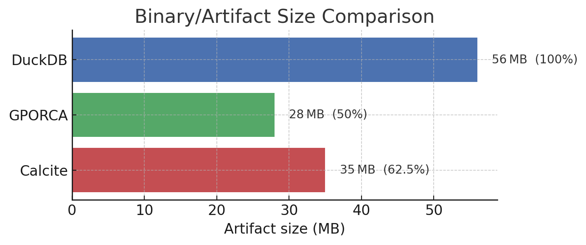

# TL;DR
- Although databases are ancient, they still provide guidance for LLMs development.
- **DuckDB's Success Formula**: Insight into trends + relentless focus on core competencies + extremely good product.
- Everyone agrees on "big data," but not everyone needs "big data."
- ["Big Data is Dead"](https://motherduck.com/blog/big-data-is-dead/), and large models are a better computational paradigm.
- Be meticulous in initial technology selection, let data guide decisions, and avoid blind trust in authority.
- Technology choices must always serve the product.
- What appears "small and elegant" is actually the result of accumulated efforts in good products.

---

# Introduction
It’s 2025, who still cares about databases? IT IS **anyone who takes data seriously**. Since their inception in the 1970s, relational databases have remained the backbone of data management. Despite waves of NoSQL, NewSQL, and other trends, the dominance of traditional databases and SQL remains unshaken. At SIGMOD 2023, Don Chamberlin, co-creator of SQL, delivered a keynote titled ["49 Years of Queries"](https://dl.acm.org/doi/10.1145/3555041.3589336), reflecting on the evolution of relational databases and SQL over nearly half a century. Chamberlin emphasized that the longevity of database systems stems from E. F. Codd’s foundational theories, such as:

- **[Database Normalization](https://en.wikipedia.org/wiki/Database_normalization)**: Teaches structured data organization to eliminate redundancy.
- **Natural Language Queries**: A vision pursued since 1974 with Codd’s ["Rendezvous"](https://dl.acm.org/doi/10.1145/1045283.1045298) project, which led to SQL.
- **[Relational Algebra Closure](https://en.wikipedia.org/wiki/Relational_algebra)**: Ensures uniform data formats for chained operations.

Fast forward 55 years: large models dominate the AI landscape, unstructured data processing explodes, yet database theory remains deeply influential. Normalization principles guide large language model (LLM) training, inspiring slogans like ["Data Quality is All You Need"](https://arxiv.org/pdf/2307.09288). Natural language queries finally thrive with LLMs (though perhaps too enthusiastically). Developers of agent systems now recognize the importance of [closure and standardization](https://medium.com/@kyeg/unlocking-structured-outputs-with-agents-8b5a564b5d44) in ensuring stable, end-to-end execution.

In the ever-shifting tech world, databases stand out as a rare bastion of stability—flashy trends come and go, but **foundational principles endure**. For database products, "mastering the fundamentals" (correctness, reliability, efficiency) remains paramount. This doesn’t imply stagnation. Instead, strong foundations empower us to navigate trends confidently. Enter [DuckDB](https://duckdb.org/), a database that marries trend awareness with technical depth. This article explores how DuckDB’s team built a competitive product by **balancing innovation and foundation**.

---

# Market Trends
In 2023, MotherDuck founder Jordan Tigani’s blog ["Big Data is Dead"](https://motherduck.com/blog/big-data-is-dead/) sparked debate while crystallizing the rationale behind DuckDB’s embedded, lightweight, single-process design.

## Debunking "Big Data Myths"—Three Truths
1. **Most organizations don’t have "big" data**. Investor surveys reveal that even large B2B companies manage mere terabytes, with many operating on gigabytes. Internal data from SingleStore and others shows core datasets often fit in single-digit gigabytes. **For most, data scale isn’t the bottleneck**.

<p align="center"></p>

2. **Storage-compute imbalance**. Modern architectures decouple storage and compute, but storage grows linearly while compute demand lags. Most analytics focus on recent data, leaving historical datasets underutilized. This "storage obsession" incurs maintenance costs for rarely accessed data.

<p align="center"></p>

3. **Rapid data value decay**. Business data often loses relevance within weeks. Historical data serves audits or model training, not daily analytics. **"Big data" is a game for the 1%**—most users operate within traditional single-machine capabilities.

<p align="center"></p>

## The Scale-Up Revolution
The "big data" era emerged when scaling out (distributed clusters) was cheaper than scaling up (powerful single machines). Today, hardware advancements flip this equation:

- **Memory/storage leaps**: DDR5 RAM hits 70GB/s bandwidth; NVMe SSDs approach DRAM latency.
- **Unified architectures**: Apple’s M-series chips fuse CPU/GPU/NPU memory, slashing data movement overhead.

Result? Tasks once requiring Hadoop/Spark clusters now run efficiently on single machines. TPC-DS benchmarks show DuckDB outperforming Spark by 3-8x on 100GB datasets with 10x energy efficiency.

## Large Models vs. Big Data
Another significant reason for the decline of big data analytics lies in the gradual transition from "big data" to "large models." As Large Language Models (LLMs) become the new technological cornerstone, the importance of traditional "big data" stacks is being re-evaluated. Large pre-trained models essentially act as [**compression and distillation** of massive datasets](https://arxiv.org/pdf/2309.10668). Insights that previously required labor-intensive analysis of terabytes of data are now embedded within these models. When people increasingly obtain information by querying models like GPT-4 instead of executing complex queries on logs or data warehouses, the underlying data processing and computational paradigms inevitably simplify.

In this landscape, embedded databases like DuckDB thrive. Projects like DeepSeek’s [smallpond](https://github.com/deepseek-ai/smallpond) leverage DuckDB for lightweight, high-performance data processing.

## DuckDB’s Ascent
Born in defiance of the 'big data' hype, DuckDB started with a simple insight: nobody was building an embedded analytical database. The chart below shows exactly what the creators saw missing:

<p align="center"></p>

Born in 2018, gaining explosive traction by 2022, DuckDB has by 2025 positioned itself as the de facto leader in the analytical processing database arena - an unprecedented rise for an embedded database:
<p align="center"></p>

---

# Product Excellence
DuckDB's success isn't just about riding the right trends - its killer product features deserve equal credit. While we could write volumes about its capabilities, let‘s highlight the most impressive ones.

## Zero-Copy Data Access
DuckDB queries external files (CSV, Parquet) without importing data. Its vectorized engine and columnar format enable efficient scans, even with partial HTTP Range requests. For example:

```sql
SELECT * FROM 'data.parquet';
```

Queries run directly on Pandas DataFrames or Arrow data, eliminating data duplication. This "Swiss Army knife" versatility aligns perfectly with data scientists’ workflows.

Queries run directly on Pandas DataFrames or Arrow data, eliminating data duplication. **This "Swiss Army knife" versatility aligns perfectly with data scientists’ workflows**.

## HTTPFS Extension
Drawing inspiration from PostgreSQL's design, DuckDB was architected with extensibility as a first-class citizen from day one. Among its extensions, ​HTTPFS stands out as a stroke of genius. This extension enables direct access to HTTP(S) endpoints and cloud object storage (like S3) - meaning DuckDB can query remote data as if it were local tables, using nothing more than a URL.

For example:
```sql
SELECT count(*)
FROM 'https://example.com/dataset/file.parquet';
```

DuckDB automatically fetches only the required file segments via HTTP. For columnar formats like Parquet, it goes further by selectively retrieving just the needed columns, dramatically improving efficiency.

This capability effectively complements the "big data" paradigm: users maintain large datasets in the cloud while pulling only relevant subsets for local analysis, even joining them with existing local datasets.

In this quintessential **"edge-cloud integration" scenario**, DuckDB delivers ad-hoc cloud data analysis **without complex middleware** -- streamlining data engineering workflows. Wait, isn't this exactly how "datalakes" were supposed to work all along?


## The Ingenious HTAP Strategy of Seamlessly Integrating OLTP/OLAP

### The "Pitfalls" of HTAP
[HTAP, or Hybrid Transactional/Analytical Processing](https://en.wikipedia.org/wiki/Hybrid_transactional/analytical_processing), aims to provide both TP and AP capabilities within a single database. This presents an opportunity for both TP-oriented and AP-oriented databases to expand their business scenarios, making HTAP a fiercely contested battleground in the database market. But is HTAP really that great? Whether extending from TP to HTAP or vice versa, one risks falling into the seemingly sweet "trap" of HTAP:

- **Storage-Compute Dissonance**: OLTP relies on row-based storage (Row Store) for high-concurrency transactions, while OLAP requires column-based storage (Column Store) to accelerate aggregate computations. Forced integration necessitates maintaining two storage engines (e.g., row-store replicas + column-store replicas), leading to skyrocketing data synchronization overhead and consistency maintenance costs.
- **Resource Contention and Performance Degradation**: OLTP's short transactions (millisecond-level responses) compete with OLAP's long queries (minute-level computations) for CPU, memory, and I/O resources.
- **Technological Conflict**: OLTP emphasizes ACID transactions and row-level locks, whereas OLAP only requires relaxed eventual consistency. For instance, full-table scans in analytical queries may trigger row-store lock contention, causing transactional operations to stall.

### Why Not Leverage the "Big Players"?
DuckDB's philosophy is: Instead of forcing a single system to handle both, let systems excelling in transactions and those specializing in analysis each play to their strengths, then bridge them. Thus, PostgreSQL and DuckDB—the two most scalable systems in the TP and AP domains—naturally converge.

On one hand, DuckDB offers the Postgres Scanner extension, which can directly connect to a PostgreSQL database and map its tables as virtual views within DuckDB for querying. This allows DuckDB to act as an analytical accelerator, reading PostgreSQL's live data without additional replication. This approach avoids the hassles of dual writes and asynchronous synchronization. During queries, data stored in PostgreSQL is efficiently read via its binary protocol, while analytical logic is executed within DuckDB.

```sql
SELECT * FROM postgres_scan('dbname=myshinydb', 'public', 'mytable');
```

On the other hand, the PostgreSQL ecosystem has seen a wave of extensions enhancing DuckDB's AP capabilities, including the official pg_duckdb by DuckDB's team.

<p align="center"></p>

In [pg_duckdb](https://github.com/duckdb/pg_duckdb)'s implementation, DuckDB aligns with PostgreSQL's logical timestamp synchronization (Logical Timestamp Alignment), ensuring analytical queries are based on the latest consistent snapshot of the transactional database, avoiding dirty reads and phantom reads. Additionally, DuckDB leverages its Postgres Scanner to directly access PostgreSQL's row-store tables, then uses its vectorized engine to execute OLAP queries, boosting AP performance without data replication. For example, in TPC-H benchmarks, third-party tests showed pg_duckdb achieving over [1000x performance gains](https://mp.weixin.qq.com/s?__biz=MzIzOTA2NjEzNQ==&mid=2454788670&idx=1&sn=24a3d2f17b8ad32dd7baed15598c4e28&chksm=ff377ebf7a2bfdf64db0980eddcdea4d586ee40f22ec68b865a5d3c464fcd7e745621b811583#rd) in complex analytical queries compared to native PostgreSQL.

**PostgreSQL and DuckDB's extensibility decouples the technical contradictions of OLTP and OLAP: PostgreSQL focuses on OLTP (e.g., order processing), DuckDB specializes in OLAP (e.g., real-time reporting), and the two achieve logical unity through in-process federated queries (rather than data copying).**

### GraphScope's Attempts
At this point, I can't help but reflect on GraphScope's attempt to extend graph analysis capabilities based on OLTP databases -- the [GART project](https://github.com/GraphScope/GART) (unfortunately, GART's latest commits are already six months old).

GART's original goal was to make OLTP databases the data source for graph analysis:

OLTP databases offer mature data management solutions. In most enterprise applications, cleaned data first lands in OLTP databases (e.g., Ant Group's OceanBase). Let GraphScope focus on graph analysis while leaving complex data management to mature OLTP databases. This vision aligns perfectly with DuckDB + PostgreSQL = HTAP. However, during GART's development, GraphScope attempted to integrate graph analysis with transactional processing via real-time graph construction (Binlog parsing), but faced challenges:

- **Overly Heavy Architecture**: Required maintaining an independent graph storage and compute cluster, with overly long synchronization chains (introducing Kafka + GraphEngine).
- **Limited Scenarios**: Strong reliance on external data warehouses made lightweight embedded graph analysis difficult. What if we adopted DuckDB and PostgreSQL's design philosophy? Here's a potential approach:

- **Native Graph Operators**: Integrate libgrape-lite (or a lighter single-machine parallel version) via PostgreSQL's extension interface to enable graph traversal, community detection, and other operations within the transactional database, avoiding cross-system data migration.
- **Federated Graph Computing**: Combine DuckDB's `read_parquet` function to directly query graph data (via [GraphAr](https://graphar.apache.org/)) from cloud storage.


---

# Product-Oriented Extreme Performance


The previous chapters showcased some of DuckDB's impressive product capabilities, but behind them all lies one defining characteristic: **speed** -- faster than large-scale Spark clusters, faster than PostgreSQL in OLTP scenarios. This performance stems from deliberate system design and architectural choices, such as:

- **Columnar Storage**: In analytical scenarios, computations typically only require a subset of columns. Traditional row storage would result in mostly inefficient scans, whereas columnar storage minimizes I/O by reading only relevant data.
- **Vectorized (Batch) Processing**: Operators process data in batches rather than row-by-row. This reduces function call overhead, improves cache utilization, and leverages modern hardware's SIMD (Single Instruction Multiple Data) parallelism.
- **Zero-Copy Operations**: DuckDB meticulously avoids memory copies during data transformations. For example, when [reading Arrow data](https://duckdb.org/2021/12/03/duck-arrow.html), DuckDB directly operates on Arrow memory buffers, and similarly outputs results in Arrow format. This enables seamless parsing of Arrow data within the query engine and direct Arrow-formatted result exports.
- ...

While these topics are widely discussed, let’s delve deeper into some of the early design choices highlighted in DuckDB’s research papers.

---

## Computational Models

During DuckDB's development, two dominant computational models existed in the database field — **Vectorized Execution** and **Data-Centric Code Generation (Compiled Execution)** — with significant differences in architecture, performance characteristics, and use cases. Both models are backed by numerous well-known systems:

- **Vectorized Execution**:
  [VectorWise](https://ir.cwi.nl/pub/19958/19958B.pdf), [DB2 BLU](https://www.redbooks.ibm.com/abstracts/tips1204.html), [Columnar SQL Server](https://learn.microsoft.com/en-us/sql/relational-databases/indexes/columnstore-indexes-overview?view=sql-server-ver16), [Quickstep](https://github.com/UWQuickstep/quickstep), etc.
- **Compiled Execution**:
  [HyPer](https://tableau.github.io/hyper-db/), [Apache Spark](https://spark.apache.org/), [Peloton](https://db.cs.cmu.edu/peloton/), etc.

However, comparing these models fairly is challenging. Directly contrasting real-world systems (e.g., HyPer vs. VectorWise) can lead to skewed conclusions due to differences in storage formats, parallelization strategies, etc. The DuckDB team adopted a **unified experimental framework** for an apples-to-apples comparison:

### Methodology
- **Unified Framework**: Implemented both models in the same system — *Typer* (compiled execution) and *Tectorwise* (vectorized execution) — ensuring identical algorithms, data structures, and parallel frameworks.
- **Isolated Variables**: Only the execution engine was altered, eliminating interference from storage compression or optimizer variations.
- **Cross-Scenario Validation**: Tested across TPC-H/SSB queries to analyze performance in compute-intensive, memory-bandwidth-sensitive, and other scenarios.

Below is their comparative analysis from this [benchmark paper](https://www.vldb.org/pvldb/vol11/p2209-kersten.pdf):


<style>
  .comparison-table {
    width: 100%;
    border-collapse: collapse;
    font-family: Arial, sans-serif;
    margin: 20px 0;
    box-shadow: 0 2px 3px rgba(0,0,0,0.1);
  }
  .comparison-table th {
    background-color: #f2f2f2;
    padding: 12px 15px;
    text-align: left;
    font-weight: bold;
    border-bottom: 2px solid #ddd;
  }
  .comparison-table td {
    padding: 10px 15px;
    border-bottom: 1px solid #ddd;
    vertical-align: top;
    min-width:150px;
  }
  .comparison-table tr:nth-child(even) {
    background-color: #f9f9f9;
  }
  .comparison-table tr:hover {
    background-color: #f1f1f1;
  }
  .comparison-table .dimension {
    font-weight: bold;
    color: #2c3e50;
  }
  .comparison-table .highlight {
    background-color: #e8f4f8;
  }
  @media screen and (max-width: 768px) {
    .comparison-table {
      display: block;
      overflow-x: auto;
    }
  }
</style>

<table class="comparison-table">
  <thead>
    <tr>
      <th>Comparison Dimension</th>
      <th>Vectorized</th>
      <th>Codegen (Compiled)</th>
      <th>Why DuckDB Chose Vectorized</th>
    </tr>
  </thead>
  <tbody>
    <tr>
      <td colspan="4" class="dimension">Performance Traits</td>
    </tr>
    <tr>
      <td>Compute-Intensive Workloads</td>
      <td>Materializes intermediates; more instructions</td>
      <td>Register-optimized; fewer instructions</td>
      <td class="highlight"><strong>Memory access optimization</strong>: OLAP workloads (e.g., hash joins/aggregations) benefit from lower memory stall cycles.</td>
    </tr>
    <tr>
      <td>Memory-Bound Scenarios</td>
      <td>Batch processing hides cache misses; optimized parallel memory access</td>
      <td>Complex loops limit prefetching/out-of-order execution</td>
      <td></td>
    </tr>
    <tr>
      <td colspan="4" class="dimension">Engineering Practicality</td>
    </tr>
    <tr>
      <td>Compilation Overhead</td>
      <td>No runtime compilation; primitives pre-compiled</td>
      <td>LLVM dynamic compilation adds latency (seconds for complex queries)</td>
      <td class="highlight"><strong>Embedded-friendly</strong>: No wait for JIT compilation; reduces first-run latency.</td>
    </tr>
    <tr>
      <td>Debugging & Profiling</td>
      <td>Isolated performance stats per primitive (e.g., selection/hash functions)</td>
      <td>Fused operators in generated code obscure performance attribution</td>
      <td class="highlight"><strong>Developer-friendly</strong>: Easier for contributors to pinpoint optimizations.</td>
    </tr>
    <tr>
      <td colspan="4" class="dimension">Hardware Compatibility</td>
    </tr>
    <tr>
      <td>SIMD Optimization</td>
      <td>Simple primitives enable manual vectorization (e.g., 8.4x speedup with AVX-512)</td>
      <td>Complex loops rely on compiler auto-vectorization (limited to ICC)</td>
      <td class="highlight"><strong>Future-proof</strong>: Higher potential for SIMD utilization gains.</td>
    </tr>
    <tr>
      <td>Multi-Core Parallelism</td>
      <td>Balanced batch splitting in Morsel-Driven parallelism</td>
      <td>Same framework, but complex code reduces HT efficiency (e.g., low gains on AMD)</td>
      <td class="highlight"><strong>Thread scalability</strong>: More balanced workload distribution.</td>
    </tr>
    <tr>
      <td colspan="4" class="dimension">Functional Extensibility</td>
    </tr>
    <tr>
      <td>OLTP Support</td>
      <td>Inefficient for high-frequency single-row ops</td>
      <td>Compiled stored procedures excel (ideal for HTAP)</td>
      <td class="highlight"><strong>OLAP focus</strong>: DuckDB targets analytics, not deep OLTP optimization.</td>
    </tr>
    <tr>
      <td>Dynamic Optimization</td>
      <td>Supports runtime adaptation (e.g., dynamic aggregation)</td>
      <td>Logic hardcoded in generated code; requires recompilation</td>
      <td class="highlight"><strong>Flexibility</strong>: Adapts to dynamic workloads.</td>
    </tr>
    <tr>
      <td colspan="4" class="dimension">Storage Synergy</td>
    </tr>
    <tr>
      <td>Storage Synergy</td>
      <td>Native fit for columnar formats (e.g., RLE/Dictionary)</td>
      <td>Requires type conversion/decompression (added overhead)</td>
      <td class="highlight"><strong>Columnar ecosystem</strong>: Reduces intermediate data materialization.</td>
    </tr>
  </tbody>
</table>

Thus, DuckDB’s choice of vectorized execution was based on a **systematic, comprehensive, textbook-grade evaluation** — even though [Peter Boncz](https://homepages.cwi.nl/~boncz/), a pioneer of vectorized execution, was an early core advisor to DuckDB.

---

## High-Efficiency MVCC Implementation

As an embedded database designed for analytical workloads, DuckDB's concurrency control mechanism fundamentally differs from traditional OLTP databases. To address batch updates, columnar operations, high compression storage, and embedded lightweight requirements in analytical scenarios, DuckDB deeply optimized its [MVCC implementation strategy](https://15721.courses.cs.cmu.edu/spring2019/papers/04-mvcc2/p677-neumann.pdf) developed by the one and only [Thomas Neumann](https://en.wikipedia.org/wiki/Thomas_Neumann), primarily solving:

- **Massive version management overhead**: Traditional row-level MVCC generates excessive redundant version data during batch updates
- **Columnar compression vs. update conflicts**: Compressed column data cannot be updated in-place, requiring avoidance of frequent decompression/recompression
- **Resource constraints in embedded scenarios**: Ensuring transaction efficiency under memory/storage limitations
- **Analytical transaction characteristics**: Coexistence needs of long-running batch operations and high-concurrency queries

Below summarizes DuckDB's innovative MVCC designs:

### **Optimizations for Analytical Workloads**

- **Columnar Batch Granularity**
  - Row-level versions create massive Undo records during batch updates, consuming memory and incurring high scan costs
  - DuckDB uses "per 2048-row × per-column version metadata" to record entire batch modifications at once

- **Storing Deltas Instead of Old Values**
  - Compressed pages cannot be modified in-place; Undo Buffer only records "change descriptions" while keeping old versions in original compressed blocks, minimizing write amplification

- ​**Write Amplification-Minimized WAL/Checkpoint**
  - Bulk inserts (e.g., COPY 10GB CSV) first write directly to new data blocks, then log "block references" in WAL; commits atomically replace blocks, while rollbacks mark blocks as recyclable (avoiding "double writes")
  - Default 16MB WAL threshold triggers auto-checkpoint (manual `CHECKPOINT` supported); `fsync` enforced pre-write for durability

### **Lightweight & Embedded Design**

- **Minimal Metadata**: 2048-row batch versions + columnar deltas ensure "zero cost when unmodified," with memory usage scaling linearly only with modifications
- **Fast Startup**: Undo Buffer stored at data page tail; recovery only needs incremental WAL parsing. DuckDB survived 4000 TPCH refresh cycles in [LazyFS](https://github.com/dsrhaslab/lazyfs) power-failure/kill-process tests with zero data loss
- **Compression-Friendly**: Version info is separated from data, keeping original column blocks compressed (no MVCC-triggered decompression/rewrites)
- **Single-Machine Concurrency**: Read transactions never block; conflicting batch writes auto-retry without lock contention

This design enables DuckDB to deliver ​**near-zero-cost concurrent transactions** and ​**analytical-grade throughput** in single-machine memory environments, meeting modern data science and local embedded applications' demands for "lightweight, compressed, ready-to-use" performance.

---

## Compilation Optimization: Focused Efficiency Where It Matters Most

Traditional database systems rely on "heavyweight" optimizers, while DuckDB implements lightweight yet **most**-practical optimization rules specifically tailored for embedded scenarios. For comparison, we examined the compiled file sizes of DuckDB versus two well-known optimization frameworks in the industry: [Calcite](https://github.com/apache/calcite) and [ORCA](https://github.com/greenplum-db/gporca-archive):

<p align="center"></p>

Clearly, these optimization frameworks are overly bulky for DuckDB's needs. Although DuckDB's engineers and researchers fully understand [the importance of query optimization for data systems, especially in analytical scenarios](https://duckdb.org/2024/11/14/optimizers.html), they didn't blindly pursue optimization perfection in their implementation. Instead, they strategically allocated their limited resources to the most critical areas, aligning with their vision of a "lightweight embedded analytical engine." They achieved an elegant balance between optimization capability and resource consumption through multi-layered architectural innovations. Here are two particularly intentional design choices:

### **Rule-First Heuristic Optimization Framework**
DuckDB employs a two-stage heuristic optimization architecture:
	- **First Stage**: Applies deterministic rewrite rules (e.g., predicate pushdown, expression simplification) based on logical equivalence, ensuring execution plan safety with minimal overhead (O(1) time complexity).
 	- **Second Stage**: Performs lightweight statistics-based cost optimization, focusing only on critical paths (e.g., join ordering) with limited search scope. Dynamic pruning strategies keep optimization time within milliseconds.

### **Statistics-Independent Cardinality Estimation Model**
DuckDB addresses the challenge of computing/missing statistics in embedded scenarios (e.g., when querying Parquet/CSV files directly where histograms can't be precomputed) by introducing:
  - **Foreign Key Inference Engine**: Automatically detects implied PK-FK relationships in schemas to build dynamic equivalence sets.
  - **Selectivity Propagation Model**: Enables multi-table join cardinality estimation via chain calculations like `card(A⋈B) = card(A) * card(B) / tdom`, achieving over 90% accuracy without stored statistics.

---


# Conclusion

DuckDB didn't just ride the "big data backlash" —- it weaponized it using a good product. By combining:
- ​**Vectorized Execution** (2-8x faster than Spark on 100GB datasets)
- ​**Zero-Copy Workflows** (Arrow/Parquet as first-class citizens)
- ​**PostgreSQL Symbiosis** (1000x+ OLAP speedups via `postgres_scan()`)
...it redefined what's possible in single-node analytics, achieving 90% of "big data" outcomes with 10% of the complexity.

DuckDB's success signals a paradigm shift:

| Era          | Dogma               | DuckDB's Answer      |
|--------------|---------------------|---------------------|
| ​**2000s**    | "Normalize all data" | "Query raw Parquet" |
| ​**2010s**    | "Scale out or die"   | "Scale up smarter"  |
| ​**2020s**    | "ETL everything"     | "Embed everywhere"  |

As LLMs democratize data access, DuckDB's ​**"small-data engine for a small-data world"** approach becomes prescient. The future belongs not to systems that demand data centralization, but to those that ​**dissolve into the workflow** -- invisible until needed, indispensable when used.


---

# References
- [49 Years of Query](https://dl.acm.org/doi/10.1145/3555041.3589336)
- [Databases in 2024: A Year in Review](https://www.cs.cmu.edu/~pavlo/blog/2025/01/2024-databases-retrospective.html)
- [Big data is dead](https://motherduck.com/blog/big-data-is-dead/)
- [Language Modeling Is Compression](https://arxiv.org/abs/2309.10668)
- [Everything You Always Wanted to Know About Compiled and Vectorized Queries But Were Afraid to Ask](https://www.vldb.org/pvldb/vol11/p2209-kersten.pdf)
- [Analytics-Optimized Concurrent Transactions](https://duckdb.org/2024/10/30/analytics-optimized-concurrent-transactions.html)
- [Join Order Optimization with (Almost) No Statistics](https://homepages.cwi.nl/~boncz/msc/2022-TomEbergen.pdf)
- [Optimizers: The Low-Key MVP](https://duckdb.org/2024/11/14/optimizers.html#expression-rewriter)

---

# Acknowledgements
Reposted from [GraphScope Posts](https://graphscope.io/blog/tech/2025/04/26/Why-DuckDB-Is-Such-A-Good-Database-Product)

